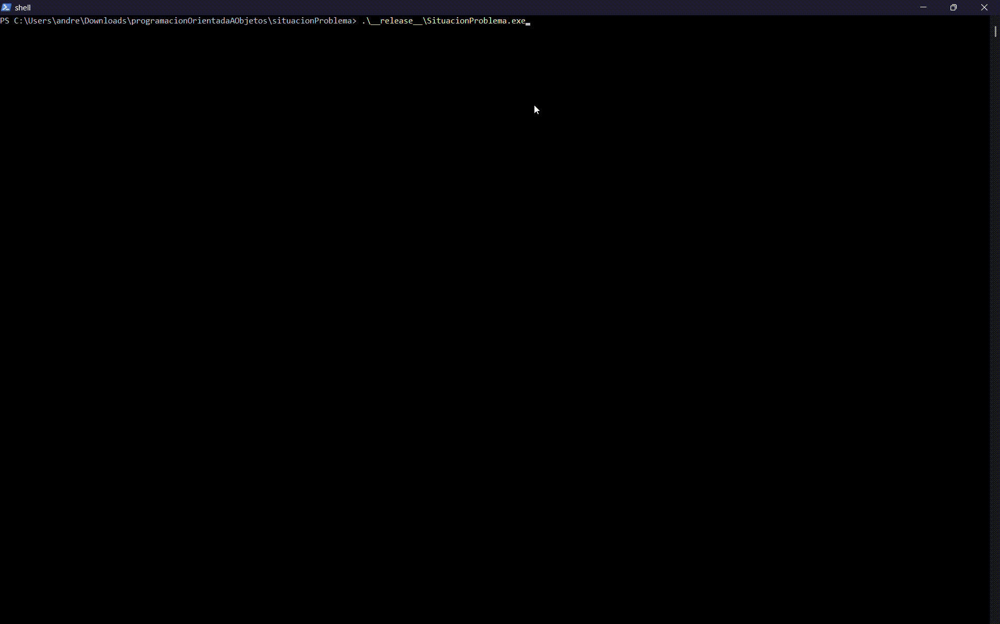
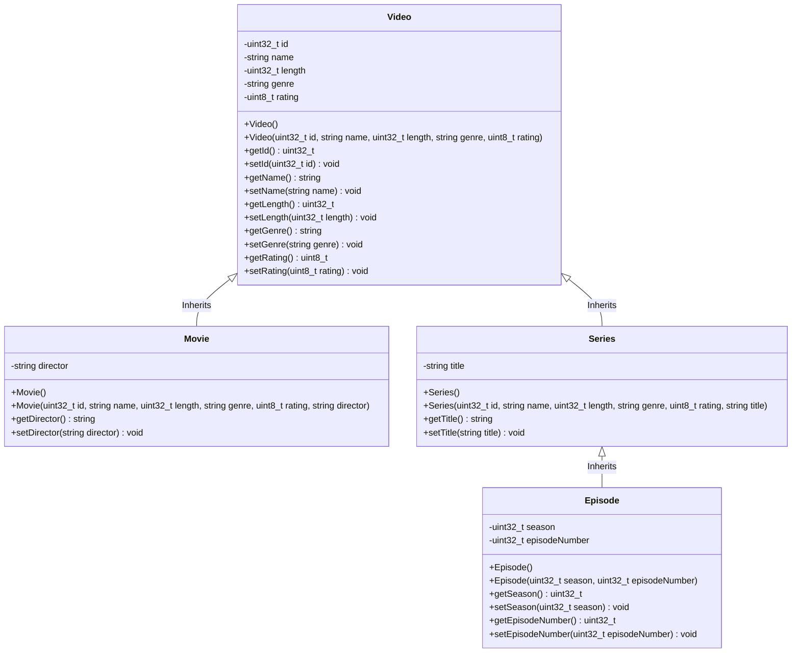

<h1 align="center">Problem situation - Object Oriented Programming</h1>
<p align="center">
    
</p>

## Team members
| Name | Role | 
| :--- | :--- |
|[Andrés Rodríguez Cantú](https://github.com/TEC-Andres)  | UX/UI CLI Designer & main developer |
|[Vicente Isaac Roldán Plata](https://github.com/VicenteRldn)  | macOS translator & tester | 
|[Eduardo Lopez Lozano](https://github.com/EduardoLL-Tec)  | Video class creator |
|[Maria José Morales Lozano](https://github.com/a01286996-tech)  | Asset designer |
|[Valentina Zazueta Monroy](https://github.com/a00844796)  | Asset designer |
|[Eduardo Salazar del Bosque](https://github.com/edusdb4048)  | Documentation |

## Description
This project is to fulfill the requirements of the Object Oriented Programming course at ITESM. The main goal is to show data to the user regarding movies, series and episodes of set series. Our preliminary state machine for our backend is as follows:




The data is going to be shown in a CLI environment; styled with ANSI escape codes to make it visually appealing. The development of the project was done in C++, although some assets were made with Python and our documentation was made with Markdown. The project is structured in a way that allows for easy maintenance and scalability, following the principles of object oriented programming.


## Requirements 
- C++17 compatible compiler
- CMake 3.10 or higher
- VSC SDK for C++ (optional, for development)
- Windows 10 or higher (for console features)

## Compatibility table
| Shell provider | Tested status | Is env functional? | Comments |
| :--- | :--- | :--- | :--- |
| Windows comcast | YES | YES | - |
| Windows Terminal | YES | YES | Small garbage bug still persists causing sidebar to show up in env. But it now initializes at the correct size |
| MINGW64 | YES | NO | UTF-16 characters are not loaded correctly & character build-up occurs |
| VSC Terminal | YES | YES | Small garbage bug still persists causing sidebar to show up in env. But it now initializes at the correct size |
| MacOS Terminal | YES | NO | UTF-16 issue |
| MacOS VSC Terminal | YES | YES | Small garbage bug still persists causing sidebar to show up in env. But it now initializes at the correct size |

## Build 
```bash
cmake -S . -B build -G "MinGW Makefiles" -DCMAKE_BUILD_TYPE=Release
cmake --build build --config Release
```

## Documentation
The documentation for this project is available in the `docs` folder of the repository. It includes an overview of the project, installation instructions, usage guides, and API references. The documentation is intended to help developers understand the structure and functionality of the application, as well as to provide guidance on how to contribute to the project. It can also be accessed online at the following link:

https://tec-andres.github.io/situacionProblemaTC1030.307/