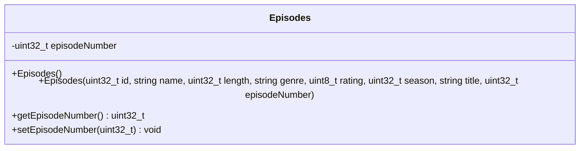

# Episodes Class

## module description
this document clarifies the low-level tracking schemas applied to map specific sub-elements tied to an inherited parent series container.

## private class members
* season - type uint32_t counter marking the specific season block placement.
* episodenumber - type uint32_t counter tracking the serial entry index of the chapter.

## structural behavior
* individual episodes embed directly into tracking arrays inside their series parents while maintaining access to foundational parent video fields via inheritance chains.
