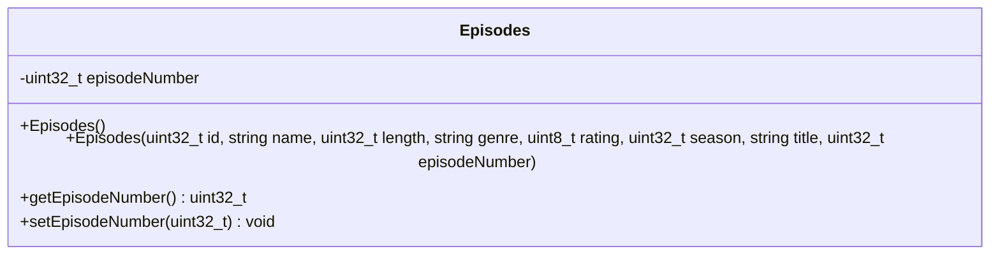

# Episodes Class

## module description
this document clarifies the low-level tracking schemas applied to map specific sub-elements tied to an inherited parent series container.

## private class members
* season - type uint32_t counter marking the specific season block placement.
* episodenumber - type uint32_t counter tracking the serial entry index of the chapter.
* title – type string title of the series

## object behavior
* inherits all properties from series and video.
* stores the specific episode number.
* allows episodes to be managed independently while remaining connected to their parent series.

## inheritance relationship
* episode is a specialized type of series.
* indirectly inherits all video attributes.
