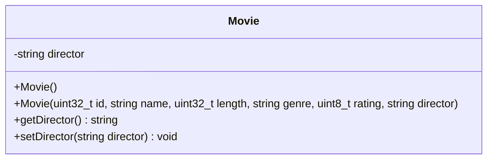

# Movie Class

## module description
this document profiles the structural fields added to the derived film class layout through standard object oriented inheritance vectors.

## private class members
* director - type string field capturing the full name of the production director.

## object initialization process
when building a movie entity, the backend executes this simple sequence:
* step 1: passes global attributes up into the generic parameterized video constructor.
* step 2: maps the unique director string directly into its private storage block.
* step 3: opens up public access using the custom getDirector() and setDirector() methods.

## inheritance relationship
* movie is a specialized type of video.
* inherits id, name, length, genre, and rating from the parent class video.