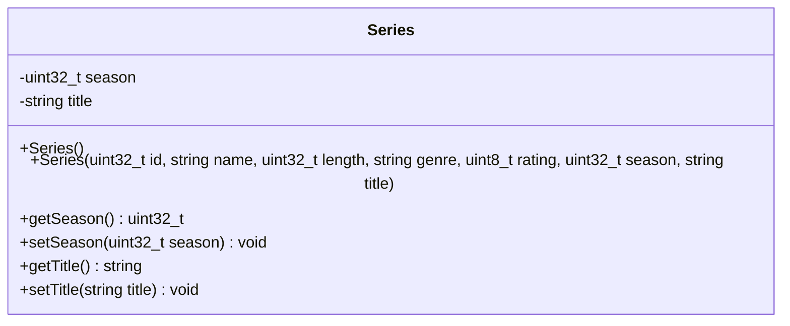

# Series Class

## module description
this document outlines the secondary derived structural layout used to bundle tv show titles before dividing contents into episode structures.

## private class members
* season – season number of the series.
* title – title of the show.

## object behavior
* stores general video information through inheritance.
* keeps track of season information.
* stores the title of the series.
* provides public methods for accessing and modifying series data.

## public operations
* connects parameter variables back to base video constructor parameters.
* provides public getTitle() and setTitle() methods to manage show data safely.

## inheritance relationship
* series is a specialized type of video.
* episodes inherit from this class.