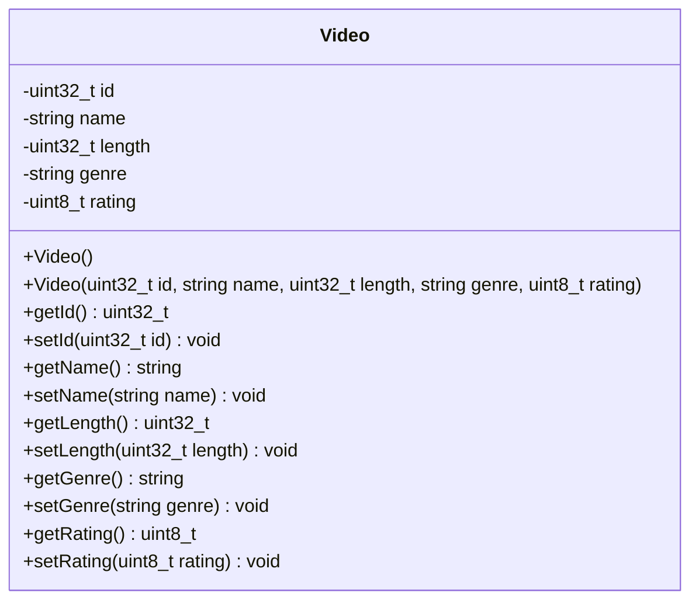

# Video Class

## module description
this document defines the underlying properties and public interface parameters that establish the core base video model for the program.

## private class members
* id - type uint32_t integer working as a unique system identifier.
* name - type string containing the title heading of the video file.
* length - type uint32_t integer tracking running runtime in minutes.
* genre - type string mapping the categorical grouping label.
* rating - type uint8_t score tracker tracking overall content quality.

## core functionality
* creates video objects using default or parameterized constructors.
* provides getter methods to access private data.
* provides setter methods to update video information safely.
* serves as the parent class for movie and series objects.
