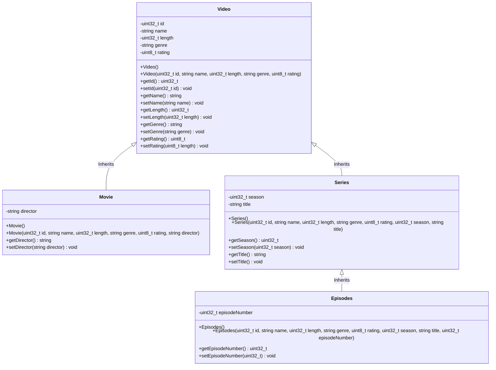

# Data Structure

This document outlines the data structure used in the application, including the format and organization of data for different components.

## Overview

This file contains the complete class diagram for the system. It shows all four classes (Video, Movie, Series, Episode) and the inheritance relationships between them.

Inheritance establishes an "is-a" relationship:

- A Series is a type of Video.
- A Movie is a type of Video.
- An Episode is a type of Series (and therefore also a type of Video)

Everything that is true for a Video (having an ID, name, length, genre, and rating) is also true for Series, Movie and Episode.

Three-level hierarchy:

- Level 1: Video - the most general class
- Level 2: Series and Movie - concrete types of video
- Level 3: Episode - an even more specific type of series

Thanks to inheritance, child classes do not need to redefine the attributes and methods that already exist in the parent class. This avoids code duplication and makes maintenance easier.
