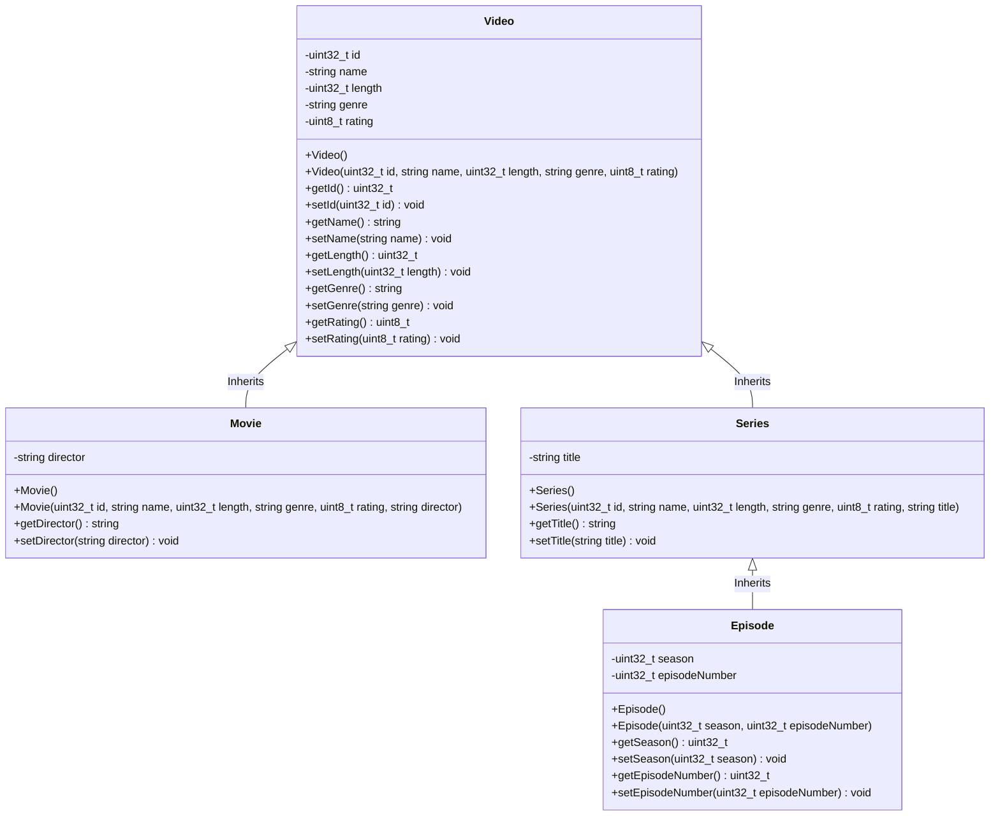

# Welcome to the Problem Situation Documentation!

This documentation provides an overview of the problem situation, including the main components and their interactions. It is intended to help developers understand the structure and functionality of the application.

---

## General Description

This website contains all the technical documentation for the interactive video management system developed for the Object-Oriented Programming course at Tec de Monterrey. The main goal of this application is to display and manage information regarding movies, series, and episodes using a Command Line Interface (CLI).

The project is built with a modular approach to allow for easy maintenance and scalability, applying core OOP concepts such as inheritance and polymorphism.

---

## Core Architecture

The backend design is split into specific modules for data handling, security, and interface design. 

Below is the class diagram representing the inheritance model for the video objects:

## Documentation Map
### Core Data & Logic

- Video Class Models: Specifications of the base video properties.  
- Movies Implementation: Movie-specific class fields and getters.  
- Series & Episodes Structure: Hierarchical coupling between series and episode classes.  
- Dynamic Arrays: Execution logic for tracking objects in runtime memory.  
- Data Management Index: Comprehensive overview of the data architecture.  

### User Access and Security
- Database Decryption: Parsing routines for local data files.  
- Environment Settings: Working variables and configuration files.  
- SHA-256 Security: Password hashing implementations.  
- Elliptic Curve Cryptography: Advanced cryptographic logic for secure access.  
- Login Framework Index: Overall layout of the security subsystem.  

### Presentation (UX/UI)
- Terminal Window Controls: Base layouts and terminal screen handling.  
- Data Tables Presentation: Matrix display of records enhanced with ANSI coloring.  
- Charts & Telemetry: Rendering real-time telemetry inside the CLI dashboard.  
- UI Controllers: Runtime control loops managing active user interface screens.  
- Modals & Updates: Dynamic modal windows and screen refreshing logic.  
- Dashboard Index & UX Structure: Main navigation entry points.  

### Project Operations and Workflows
- Compilation Guide: Building binaries locally using CMake 3.10+.  
- Execution Paths: Deployment instructions across compatible platforms.  
- Git Protocols: Branch naming conventions and lifecycle environment rules.  
- GitHub Rules: Guidelines for managing issues and submitting pull requests.  

## Technical Details
- We use operator overloading on parameters by using the `operator` keyword in C++. This allowed us to build a more intuitive and user-friendly constructor and assignment operators for programming purposes.  
- The use of templates allows for generic programming, which can improve code reusability and reduce the number of duplicate functions or classes.  
- The usage of inheritance on components and video classes allows for code reuse and a more organized structure, making the codebase easier to maintain and extend.  
- The use of encapsulation helps to hide the internal details of the classes and provides a clean interface for interacting with the objects.  
- The use of polymorphism allows for more flexible and dynamic code, enabling different objects to be treated as instances of the same type through a common interface.  
- The use of const correctness helps to ensure that the data members of the classes are not accidentally modified, which can improve the reliability and performance of the code.  
- The usage of pointers to store figures without needing to feed it to stack.   
- The usage of external libraries `OpenSSL` and `SQLite3` for cryptographic and database operations respectively.  